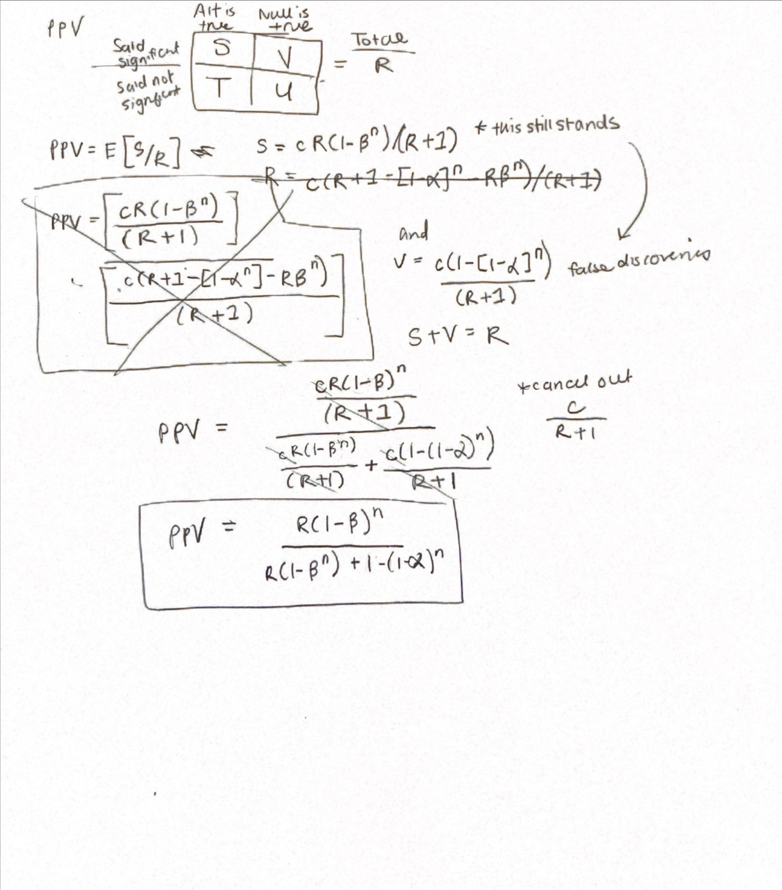
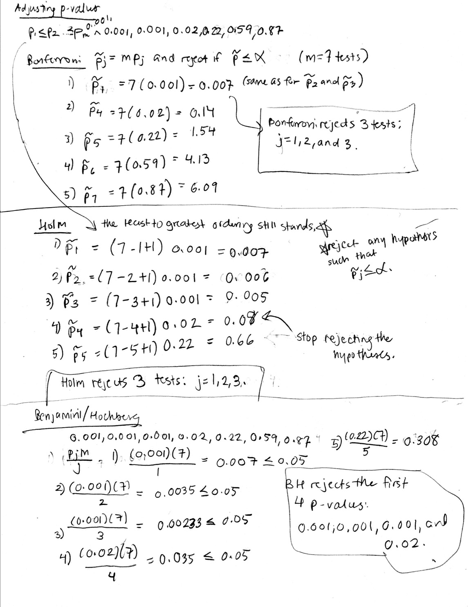

```{r}
#| echo: false

library(tidyverse)
library(broom)
library(survival)
library(survminer)
library(praise)
```


### Assignment Summary (Goals)
* understanding PPV
* type I and type II errors
* adjusting p-values to control for multiple comparisons
* early stopping rules

Note that if you don't know the R code either check my notes or ask me!!!  Happy to scaffold, debug, send resources, etc.  Don't go down a rabbit hole trying to figure out an R function or syntax.


#### Q1. Positive Predictive Value
From the Ioannidis paper, explain the details of PPV for the model with **multiple researchers**. Derive the entire PPV equation (you may need to derive most of Table 3).

My understanding is that PPV is the expected value of true results over all significant results. When it's with multiple researchers, the chances of significance are greater even if that reported significance is false. The more researchers that test the same claim, the less reliable the findings become because the PPV falls (the denominator gets bigger is why). 

Derivation: 

```{r}


```

 

#### Q2. Evaluating errors part 1

Consider the following claim (which may or may not be true): 

> If a null hypothesis is NOT rejected in multiple studies, then we have good evidence that the null is likely to be true.

Five datasets study the same phenomenon; each has treatment and control groups.  Do the two groups differ, on average, with respect to the continuous response variable? Your task:


a. Is the response variable different for treatment vs. control? Look at p-values & CIs. Consider (1) the datasets separately, and (2) the datasets combined into one analysis.

Yes, the response variable is different for trt vs. control, but it depends on whether we're looking at the data-sets separately or combined. In the data-set separately, the p value is not significant at 0.05; also its response variable includes 0 so we should not reject the null hypothesis from this analysis. In the combined analysis, the p-value is significant at 0.05 and the confidence interval excludes 0  which indicates that we can reject the null hypothesis and declare there's a difference between treatment vs. control. 


b. Respond to the claim above.

Repeated failure to reject the null in individual studies doesn't necessarily mean that the null is true for that claim, since some individual studies may just be non-significant and under-powered. However, when the analysis is combined, the effect could be significant. 

You might consider R code like the following. The data, `type1data.txt` should already be in the GitHub repository / R project, so the code I've written should load the data automatically for you. 

```{r eval = FALSE}
errordata <- read_delim("type1data.txt", delim = "\t")

# this will produce output of one data set separately
t.test(resp1 ~ group1, data = errordata) |> tidy()

response <- c(
  errordata$resp1,
  errordata$resp2,
  errordata$resp3,
  errordata$resp4,
  errordata$resp5
)

group <- c(
  errordata$group1,
  errordata$group2,
  errordata$group3,
  errordata$group4,
  errordata$group5
)

# this will produce combined dataset output
t.test(response ~ group) |> tidy()
```


#### Q3.  Evaluating errors part 2

Consider a large randomized controlled trial designed to investigate problem drinking in Australian university students (Kypri et al., *Randomized controlled trial of proactive web-based alcohol screening and brief intervention for university students.*, 2009).  They specified 7 outcomes in advance, 3 were primary and 4 were secondary.  No adjustments for multiple comparisons were made, and the p-values were reported to be 0.001, 0.02, 0.001 (primary endpoints), 0.59, 0.87, 0.22, 0.001 (secondary endpoints).


a. Adjust the p-values using Bonferroni, Holm, and Benjamini-Hochberg.  Do all 3 methods give the same conclusions with respect to significance?  Explain.

```{r}


```


b. Note that the Bonferroni and Holm adjusted p-values report the smallest familywise error under which each of the tests would reject the null hypothesis.  Benjamini-Hochberg report the experiment wide FDR if all tests below a critical value are rejected. Explain why (within each of the methods) some of the adjusted p-values are repeated.

In Bonferroni, the adjusted p values of rank j = 1,2,3 are repeated, because of the formula adjusted-p = (# of tests)(raw p). Since the # of tests says the same (m=7) and the raw p is the same (0.001), the adjusted p value will be repeated. In Holm, you will perform maximizing in the p-value adjustment because without it, the order of the raw p values and adjustd p values would be reversed; by maximzing the adjusted p-values, you will ensure they are monotonically increasing. In Benjamini-Hochberg, I'm not sure if there's a way adjusted p-values would be repeated.


c. Explain how adding 100 more tests (all of whose unadjusted p-values are greater than 0.1) would change each of the adjusted p-values (and corresponding conclusions).

Adding 100 more tests would make the adjusted p-values larger, since m will be 107. Bonferroni and Holm would be a lot more conservative and reject no tests. Benjamini-Hochberg would reject 1 less test when m=107, compared to when m=7 tests.


#### Q4. Stopping Times

Consider the early stopping methods we discussed in class. Let's say that you want to look at the data 3 times.
Which stopping rule would you recommend if your primary goal is to stop a trial as early as possible when there is strong evidence of efficacy?
Explain.

Pocock since it is "aggressive with respect to stopping early." (9 Multiple Comparisons Methods in Biostats Notes) The same significance threshold is set for each checkpoint of looking at the data, which gives a high chance of stopping early on; in contrast, OBrien-Fleming is extremely strict at early stopping times and has more wiggle room for error later on.


```{r}
praise()
```
